# Predictive Maintenance Lab 1 — Streaming Data with Linear Regression–Based Alerts/Errors

This project extends the Data Stream Visualization Workshop by adding **regression-based anomaly detection** for industrial current data. 
It simulates a predictive maintenance use case where **Alerts** and **Errors** are raised when measured currents deviate from their **expected (regression) behavior** for sustained periods.

## Table of Contents
- [Project Summary](#project-summary)
- [Repository Layout](#repository-layout)
- [Setup](#setup)
- [Data](#data)
- [How to Run](#how-to-run)
- [Regression & Alert/Error Rules](#regression--alerterror-rules)
- [Screenshots / Plots](#screenshots--plots)
- [Troubleshooting](#troubleshooting)

## Project Summary

- **Goal:** Stream (or simulate streaming) current readings for **Axes #1–#8**, learn **per-axis linear regression** models *(Time → Axis value)*, and raise **Alerts/Errors** when **positive residuals** (observed − predicted) exceed **data-driven thresholds** for **sustained durations**.
- **Key ideas:**  
  - Use **univariate linear regression per axis** to capture trend.  
  - Analyze **residuals** to discover **MinC/MaxC** thresholds (no fixed values provided).  
  - Use **run-lengths** of residual exceedances to set duration windows **T_LONG** (Alert) and **T_SHORT** (Error).  
  - **Validate** on a hold-out or synthetic stream and report **alerts/hr** and **errors/hr**.

## Layout
├── data/
│ ├── RMBR4-2_export_test.csv # training/reference CSV
│ ├── RMBR4-2_export_synth_v6.csv # synthetic test CSV (generated)
│ └── synthetic_offline_events.csv # detected events (output)
├── plots/
│ └── axis_?_fit_and_residuals_scatter.png # per-axis fit & residual plots (output)
├── captures/
│ ├── ex) capture_error_axis7_20250923_031019_i5845
│ └── ex) capture_alert_axis2_20250923_005648_i1610
├── Practical Lab 1.ipynb
│ ├── 01_Database Integration
│ ├── 02_Streaming Simulation
│ ├── 03_Regression Models & Residual Analysis
│ ├── 04_Threshold Discovery & Justification
│ ├── 05_Alerts & Errors Implementation
│ ├── 06_Visualization / Dashboard
├── requirements.txt
└── README.md

## Setup

### 1) Python environment

1. Use Python version 3.11 or 3.12
2. Create Virtual environment
   `python -m venv .venv`
3. Activate virtual environment
### 2) Install dependencies from a 'requirements file'

4. Open new terminal
5. `pip install -r requirements.txt`

## Data

- Training/reference CSV: data/RMBR4-2_export_test.csv

- Synthetic test CSV: generated as data/RMBR4-2_export_synth_v6.csv
The generator targets ON-state mean/std per axis and guarantees nonnegativity.
When streaming or validating, normalize/standardize test data using training statistics to keep scales consistent.

## How to Run

Use notebooks or factor the cells into scripts—either flow works. The steps below map to the implementation already in this repo.

1. Load & pivot, remove global OFF, build time axis
  - Read (ts, axis_id, value) from DB (read_from_db()).
  - Pivot to wide ts × axis frame, drop rows where all axes are 0 (global OFF).
  - Build time_s (seconds since first timestamp).
  - Split chronologically into train (80%) / valid (20%).

2. Per-axis linear regression & residual analysis
  - For each axis k∈{1..8}, fit value_k ~ time_s using non-zero (equipment ON) samples.
  - Compute residuals r = y − ŷ, store stats: slope/intercept, R², residual std, positive residual p95/p99 (or your chosen percentiles).

3. Discover thresholds (MinC/MaxC) & durations (T)
  - MinC/MaxC: Use trimmed percentiles on positive residuals (with robust fallback: median + {2,3}×MAD if few samples).
  - Durations: Convert defaults T_long_sec_default and T_short_sec_default to samples using rate.
    -> Refine via run-length quantiles on training masks:
       > T_LONG = max(default, q95 of runs where r ≥ MinC)
       > T_SHORT = max(default, q50 (median) of runs where r ≥ MaxC)

4. Validate on hold-out / synthetic stream
  - Apply models, th, T_counts to validation data.
  - Detect events (open/upgrade/close) from residual exceedances.
  - Report alerts/hr and errors/hr per axis.
  - Save events to data/synthetic_offline_events.csv.

5. Streaming Playback + Live Alerts/Errors
  - Real-time streaming plot
  - Real-time plot of errors and alarms
  - Capture and save error/alarm

6. Dashboard
  - Render 2×4 board: observed vs. fit, highlight points where r ≥ MinC/r ≥ MaxC, overlay ALERT/ERROR bands with duration labels.
  - Save to data/offline_dashboard.png.

## Regression & Alert/Error Rules
1. Model
  - For each of the 8 axes, build a simple linear trend over time that represents how the value typically changes.
  - Train this model only when the equipment is ON (i.e., axis value is not 0).

2. Residuals
  - Compare the actual measurement to the model’s expected value.
  - Treat only the amount above expectation (positive deviation) as an anomaly signal
    (e.g., to capture over-consumption/overload situations where current draw is higher than expected).

3. Thresholds (MinC/MaxC)
  - Examine the distribution of positive deviations to understand what values are typical.
  - Set Alert/Error thresholds based on the upper portion of that distribution (e.g., upper percentiles).
  - If the data is sparse or skewed, use a conservative fallback based on median and MAD (median absolute deviation).
  - Because scale/behavior can differ per axis, it’s recommended to set per-axis thresholds.

4. Durations (T_LONG/T_SHORT)
  - A run length is the number of consecutive samples where a condition (exceeding a threshold) holds.
  - Alert: triggered when a small/moderate exceedance lasts long enough.
    → Raise an alert if the value stays ≥ MinC for at least T_LONG continuously.
  - Error: triggered when a larger exceedance lasts for a shorter time.
    → Raise an error if the value stays ≥ MaxC for at least T_SHORT continuously.
  - Start from defaults (e.g., Alert = 5 s, Error = 3 s) and adjust using the run-length distribution observed in training.
    Typically, Alerts use a higher (longer) quantile to require longer sustain, while Errors use something around the median to avoid being too short.
           **> (Personal Analysis)** 
             - If the run-length quantiles exceed the configured defaults, T would be raised above the default; however, because this dataset has almost no long-duration cases,
               T ends up being determined by the default values only.

5. Intuition
  - Alerts filter out brief noise and focus on sustained anomalies.
  - Errors react quickly to stronger deviations, but still require a minimum duration so they don’t fire on instant spikes.

**6. Personal analysis and judgment criteria summary**
  - Initial configuration
     > Given the characteristics of current signals, I set T_LONG = 5 samples (~10 s) so that Alerts are raised only when values stay above the threshold for a long time, in order to protect temperature, equipment, and performance.
     > For Errors, considering spark-like large spikes or situations that could cause instantaneous damage to the equipment, I decided to trigger even if a value above p99.7 appears for just 1 sample (~2 s).
  - However, after analyzing data across all axes:
     > Periods where the signal stays above the threshold for a long time are very short.
     > There are cases (e.g., Axis 7) with no momentary spikes and values within the normal operating range, yet far enough from the mean to trip the MaxC setting.
  - Final settings after reviewing all results:
     > Alert MinC: set to p75
     > Error MaxC: set to p95
     > T_LONG: 3 samples (~6 s)
     > T_SHORT: trigger at ~4 s (≈ 2 samples)

## Screenshots / Plots

plots/axis_{k}_fit_and_residuals_scatter.png — per-axis observed + fit + residual guides
Axis_1 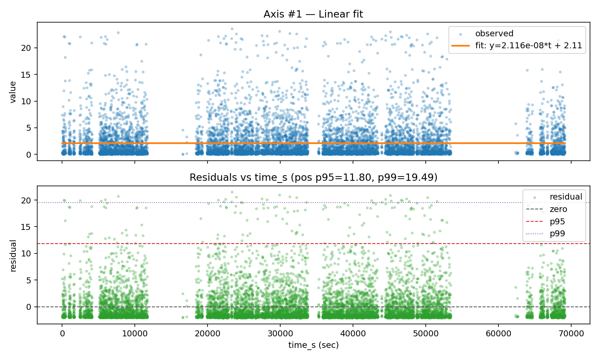
Axis_2 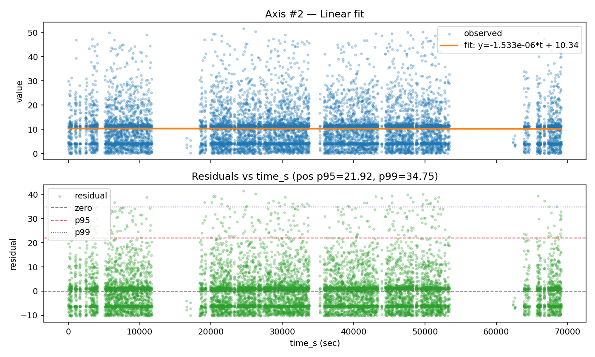
Axis_3 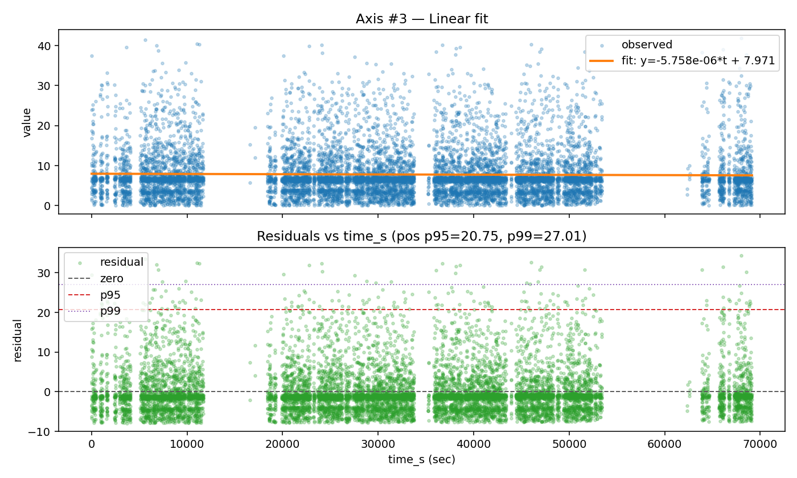
Axis_4 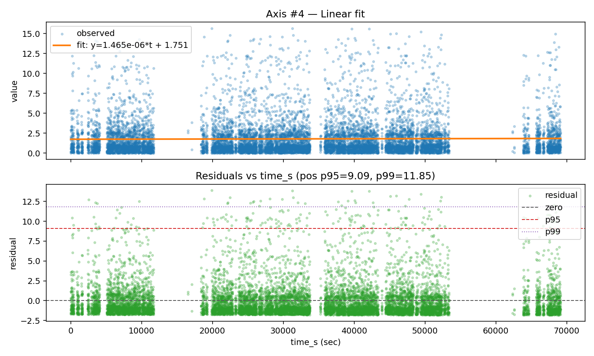
Axis_5 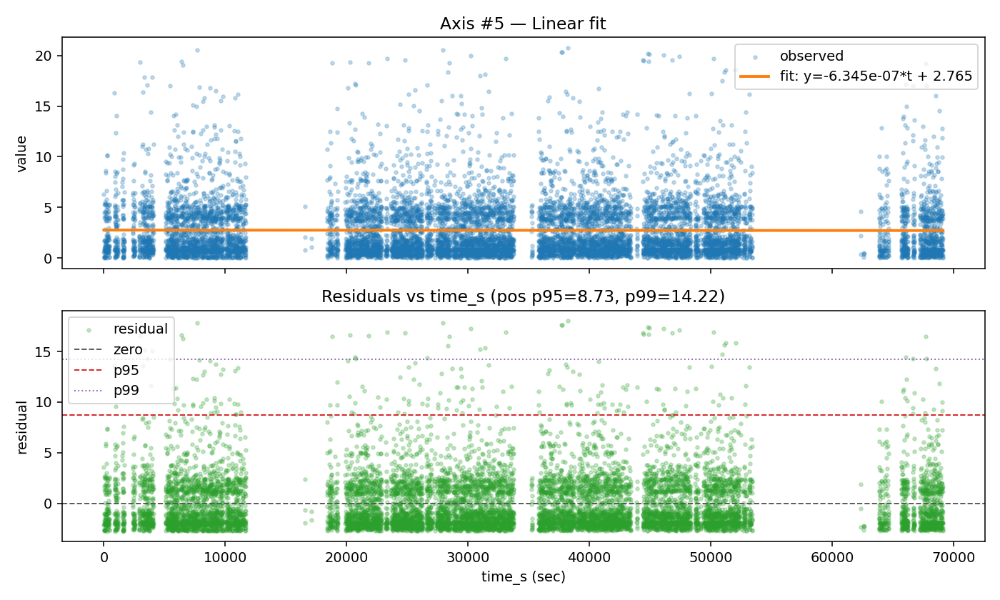
Axis_6 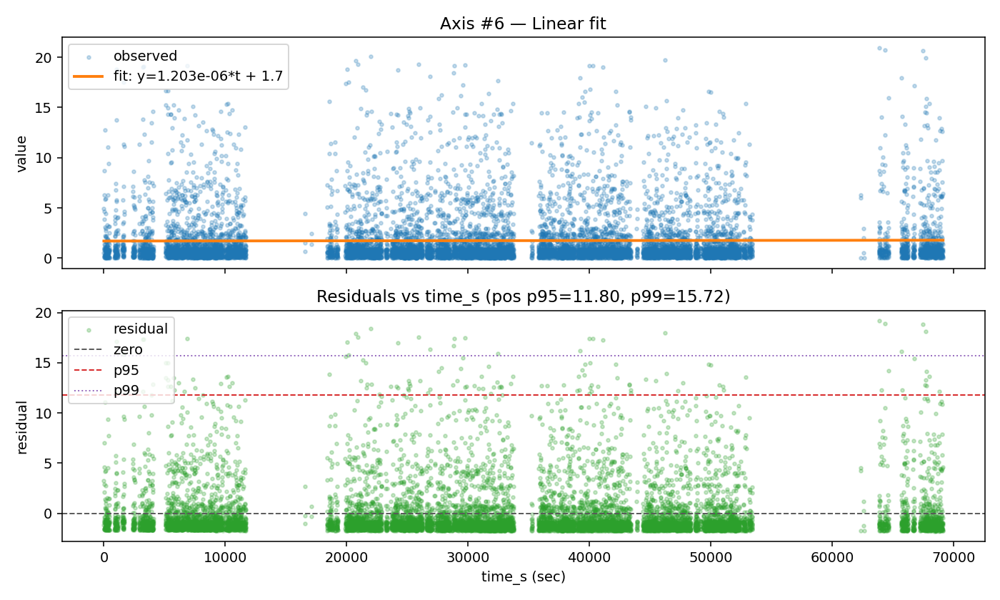
Axis_7 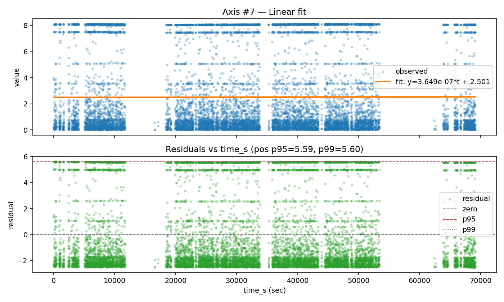
Axis_8 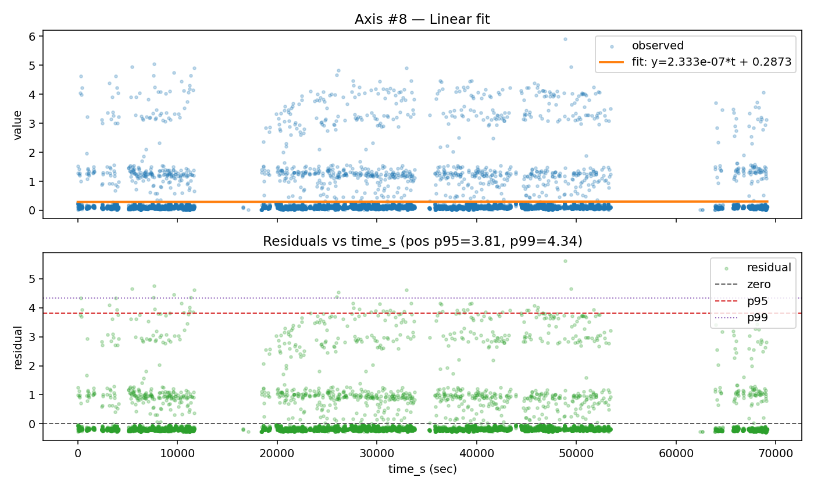

data/offline_dashboard.png — 2×4 dashboard with ALERT/ERROR bands and duration labels
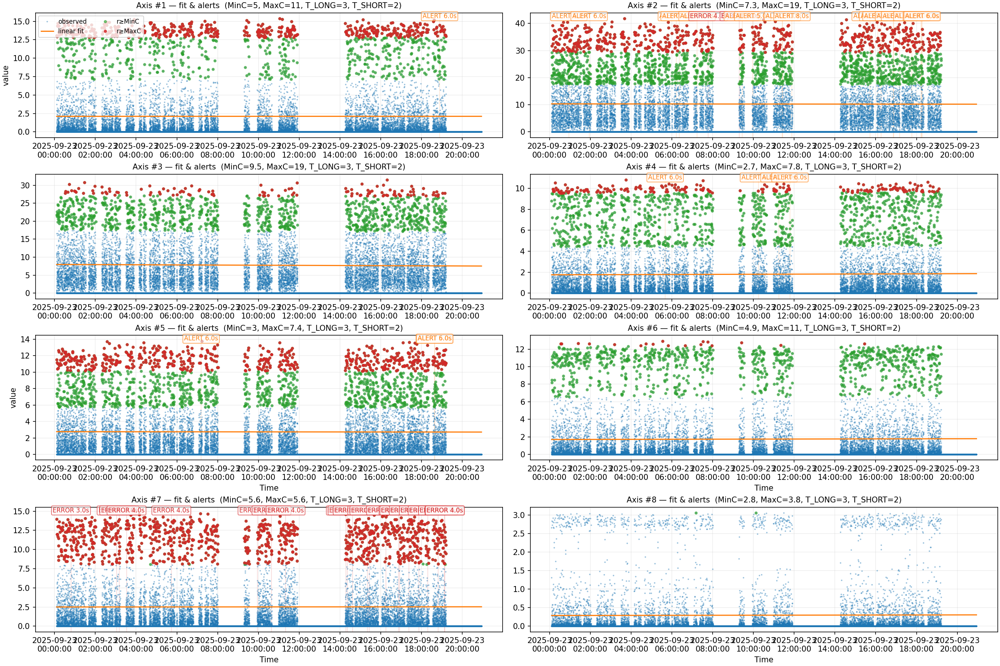

data/synthetic_offline_events.csv

captures/capture_alert_axis{k}_{time} - Caputer each ALERT/ERROR
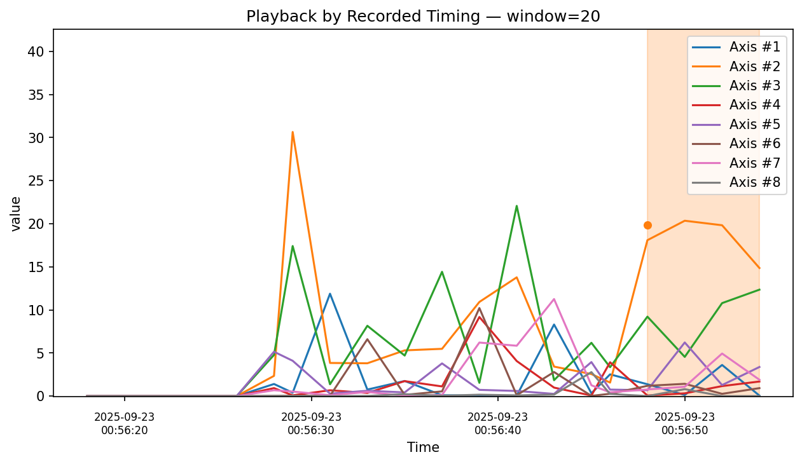
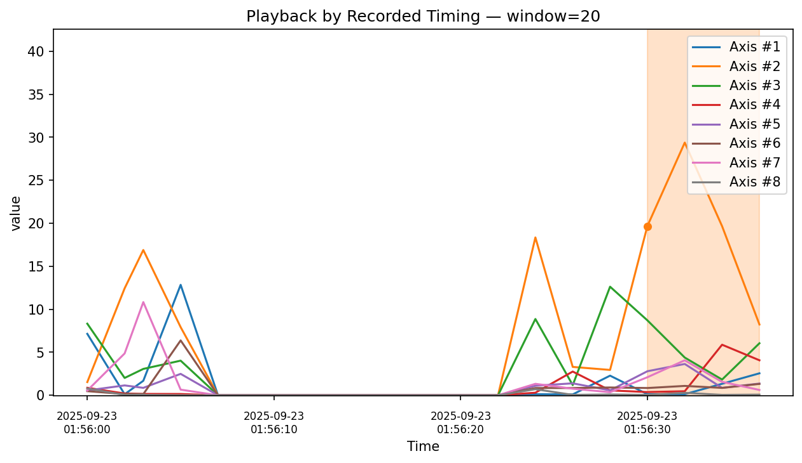
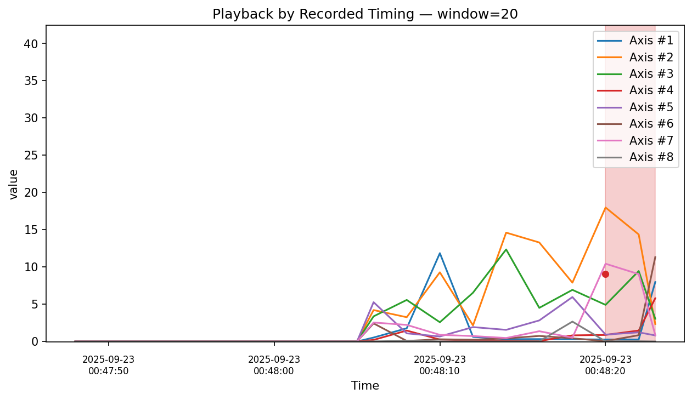
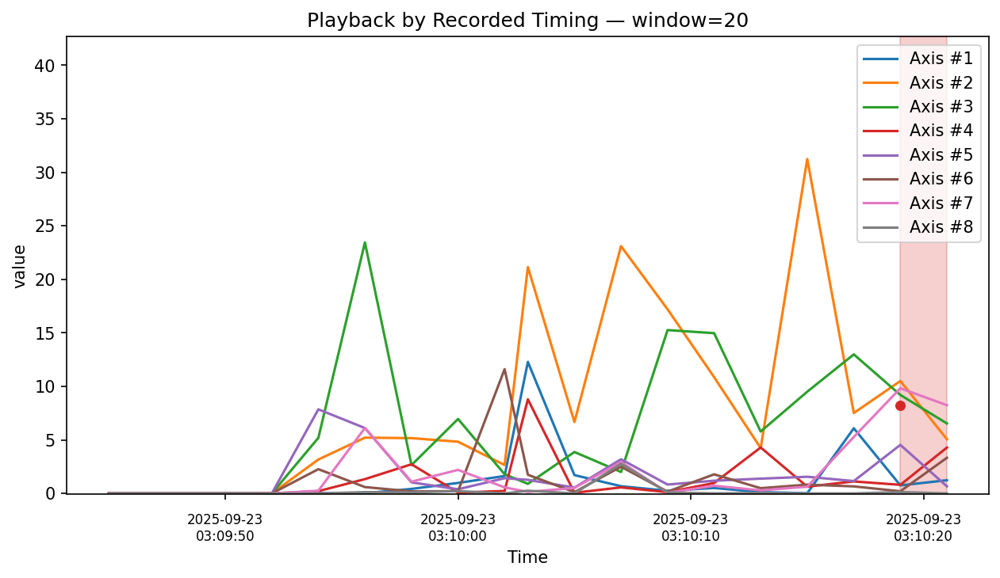

## Troubleshooting

  - No ON rows detected: Check ingestion or CSV—rows where all axes are 0 are treated as global OFF and removed.
  - Time parsing errors: The code tries multiple datetime formats; otherwise it falls back to numeric. Ensure a valid Time/Timestamp/Datetime column.
  - Sampling rate is NaN: Duplicate timestamps or irregular spacing—clean duplicates or compute a fixed rate.
  - Thresholds too strict/lenient: Tune percentile choices (e.g., p90–p95) or defaults (T_long_sec_default, T_short_sec_default), then re-evaluate alerts/hr.